  

 

---

## 👨‍💻 About Me

I'm **Emmanuel Siele**, a **Full-Stack Web Developer** passionate about building real-world projects and contributing to open source. Based in **Kisii, Kenya**, I'm actively exploring the intersections of **AI, Android development, IoT, and DevOps**.

I build across the stack — from polished frontends to robust backends — and love turning ideas into production-ready products.

*  **Full-Stack Development** — Web apps from frontend to backend, REST APIs, and modern UI
*  **AI & Machine Learning** — Exploring practical AI integrations and intelligent systems
*  **Android Development** — Native and cross-platform mobile experiences
*  **IoT** — Connecting hardware to the web with smart, embedded solutions
*  **DevOps** — CI/CD pipelines, containerization, and infrastructure automation
*  **Open Source** — Contributing to and building community-driven projects
*  **Affiliated with** — [BitBridge](https://bitbridge.co.ke/) & [Ophicore Digital](https://ophicore.digital/)

---

##  Technical Stack

<table>
<tr>
<td valign="top" width="50%">

###  Frontend

  

<code>HTML</code> · <code>CSS</code> · <code>JavaScript</code> · <code>TypeScript</code> · <code>React</code> · <code>Next.js</code> · <code>Tailwind CSS</code>

</td>

<td valign="top" width="50%">

###  Backend

  

<code>Node.js</code> · <code>Express</code> · <code>Python</code> · <code>PHP</code> · <code>PostgreSQL</code> · <code>MongoDB</code> · <code>MySQL</code>

</td>
</tr>

<tr>
<td valign="top">

### 📱 Mobile & IoT

  

<code>Android</code> · <code>Kotlin</code> · <code>Flutter</code> · <code>Arduino</code> · <code>Raspberry Pi</code>

</td>

<td valign="top">

### ⚙️ DevOps & Tools

  

<code>Git</code> · <code>Docker</code> · <code>Linux</code> · <code>CI/CD</code> · <code>GitHub Actions</code>

</td>
</tr>
</table>

---

##  GitHub Activity

  
  

 

  

  

---

##  Connect

&nbsp;&nbsp;

&nbsp;&nbsp;

&nbsp;&nbsp;

&nbsp;&nbsp;

 

**Building real-world projects. Exploring what's next.**

 

